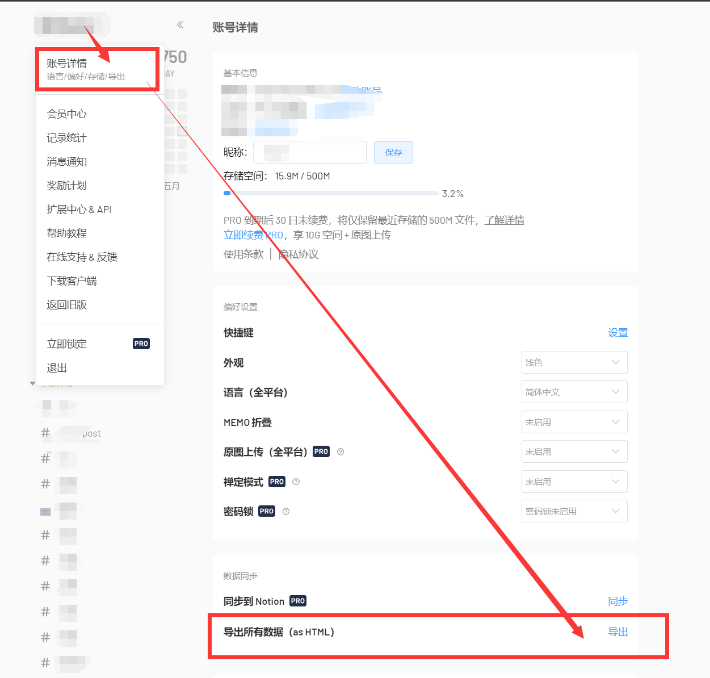

## Flomo To Memos
### 实现思路
1. 将flomo浮墨导出的数据转成json文件
2. 读取json文件将内容和附件图片等通过API上传到你的memos

### 完成功能
- [x] 📃内容上传
- [x] 🏞️图片上传
- [x] 🔗简单其它附件上传
- [x] 🕒修改memos创建时间与flomo一致

### 当前环境
> - python: v3.10
> - memos: v12.2
> - flomo: 2023.5.11

## 使用方法
1. 将flomo导出并下载
2. 将下载后的文件放进 `flomo` 文件夹
3. 安装依赖
4. **修改 `memos/api.py` 的 `Host` 参数**
5. **登入你的 memos站点 将请求头 `cookie` 的值全部复制到 `Cookie.txt`** (因为apikey的请求不能添加附件, 只能这样)
6. 运行 `servicer.py` 生成json
7. 运行 `controller.py` 将内容和图片附件上传到 memos (图片等附件多的建议先在memos配置对象储存)
8. 如何不满意可以运行 `controller.py` 的 `delete()` 方法, 删除上传内容, 再去资源库一键清空未使用图片 , 再**自定义代码** !
